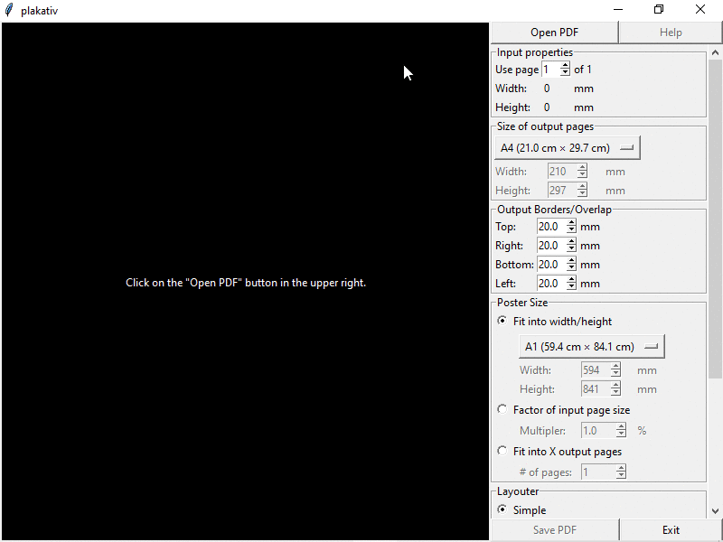
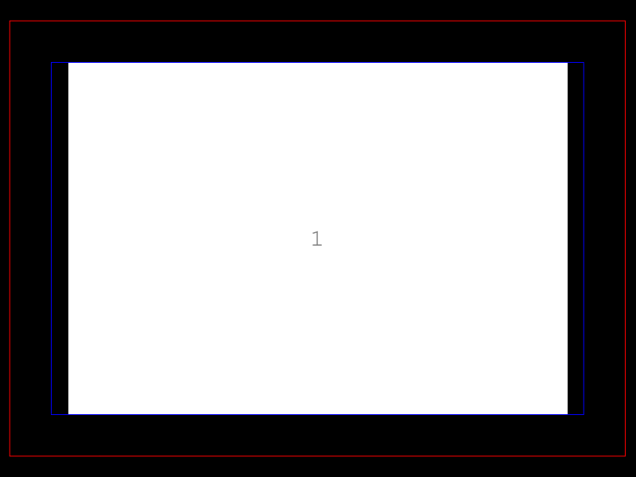

plakativ
========

Plakativ is German for "striking" or "eye-catching" and comes from the German
word "Plakat" which means poster in English.

This software allows one to stretch a PDF document across multiple pages that
can then be printed on a common inkjet printer, cut and glued together into a
larger poster.

Features
========

Plakativ allows one to create a poster using one of three different approaches:

 - I want a poster that fits into size X
 - I want a poster Y times the input page page area
 - I have Z pages of paper and want to print the biggest possible poster on them

Plakativ works on Windows, Linux and MacOS. It offers a GUI based on tkinter, a
command line interface and can be used as a Python module. Everything is inside
a single file.

Demo
====

[//]: # (To make a new Video, run:)
[//]: # (ffmpeg -f x11grab -framerate 30 -video_size 800x600 -i :0.0+41,46 -preset ultrafast -c:v libx264 -crf 0 out.mp4)
[//]: # (ffmpeg -i out.mp4 -ss 00:00:04.000 -r 2.5 plakativ%04d.png)
[//]: # (convert -loop 0 plakativ*.png +map -layers Optimize plakativ.gif)
[//]: # (gifsicle -b -O3 plakativ.gif)

The demo shows a user choosing between the three different ways to define the
poster size. Either by picking a size that the input will be fit into, by
multiplying the area of the input page or by maximizing the poster size, given
a number of pages one is willing to print on.

Installation
============

Plakativ is available from pypi: https://pypi.org/project/plakativ/

Thus you can just run `pip install plakativ` on your platform of choice.

For Microsoft Windows users, PyInstaller based .exe files are produced by
appveyor. If you don't want to install Python before using plakativ you can
head to appveyor and click on "Artifacts" to download the latest version:
https://ci.appveyor.com/project/josch/plakativ

Complex Layouter
================

Oftentimes there is a way to create a poster of a specific size with less pages
than would be needed with a regular arrangement of pages into rows and columns.
For regular poster sizes, a more complex layout can save up to 3 or 5 pages of
paper. If the regular simple layout and the complex layout require the same
number of pages for a particular poster size, then plakativ will fall back to
the simple layout. The following animation shows the complex layout that
plakativ chooses when asked to produce the largest possible poster using X
pages. The number of pages X can be seen in the center.

Bugs
====

https://gitlab.mister-muffin.de/josch/plakativ/issues

TODO
====

While basic functionality is implemented, lots of work remains to be done:

 - help button
 - print poster borders
 - print cutting guides
 - changing units
 - changing language
 - make PyMuPDF dependency optional
 - optionally, use pdfrw and/or pypdf2 to read/write PDF
 - improve command line interface
 - improve module interface

Comparison to similar software
==============================

PosteRazor
----------

http://posterazor.sourceforge.net/

PosteRazor served as the inspiration for this software. But in contrast to
PosteRazor, plakativ allows PDF documents as input and outputs PDF document
with the exact same quality as the input. It is thus not necessary anymore
to first do a lossy rasterization of an input PDF so that one can work with
PosteRazor.

pdfposter
---------

https://pdfposter.readthedocs.io/en/stable/

 - no GUI
 - cumbersome box definition
 - no page borders for glueing
 - superfluous empty pages
 - only very simple layouter
 - scaling by width/height instead by area makes doubling unintuitive
